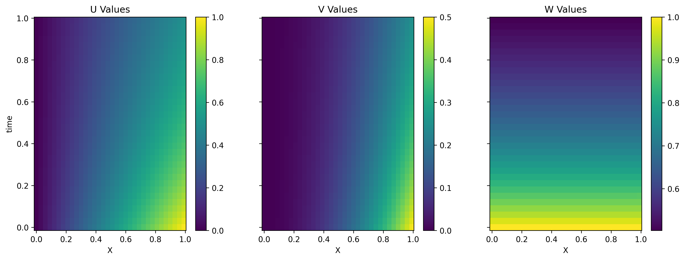

# Burgers_equation_CFD
A mechanical engineering CFD class assignment that solves the Burgers equation.


# How to use code
1. Create object Mesh Grid with Mesh2D. you can set defult value for U, V and W.
    ```python
    mesh_2D = Mesh2D(
        l_x, l_t, f_delta_x, f_delta_t, NodeGen=Node, MAX_NODE_EACH_DIM=10000000, 
        defult_val_U = .0,
        defult_val_V = .0,
        defult_val_W = .0,
    )
    ```
    * l_x, l_t is length of x and t.
    * f_delta_t and f_delta_x are functions that return the value of deltas. (you can non uniform delta).
    
2. Create object Solver and pass mesh object.
    ```
    solver = Solver(mesh_2D)
    ```
3. Call solve func and pass solver and wait for solve keller box in all time steps
    ```python
    s = solver.solve(
        solver=thomas_method_block,
        MAX_CONV_COND=0.01
    )
    ```
Note: you can pass any solver functions. in this case we use thomas algorithms for solve keller box. this function implement in utils.py file.

# Plots outputs
you can call this function and analysis U, V and W.
1. ```Mesh2D(obj).plot_mesh()``` 
    > plot mesh grid
2. ```Mesh2D(obj).plot_params("<type value "U" or "V" or "W">") ```
    > plot all time for value type (pcolormesh)
3. ```Mesh2D(obj).plot_n_timeframe(<spesific time index>) ```
    > plot U, V and W in specific time
